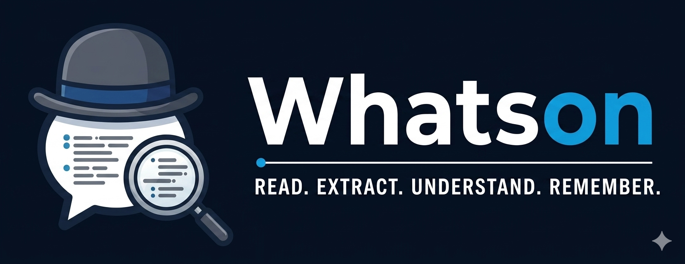

# Whatson — Configuration Reference

Whatson is a context agent built on OpenClaw. It ingests messages and documents
via Telegram, Slack, or Microsoft Teams, extracts structured facts into a
temporal knowledge graph, runs consolidation passes to resolve duplicates and
contradictions, and exports the active knowledge base to a target repository
as structured markdown.

This document lists every environment variable Whatson reads. Copy
[.env.example](.env.example) to `.env`, fill in required values, then
`docker compose up -d openclaw-gateway`.

---

## Required

| Variable | Description |
|---|---|
| _Agent provider key_ | At least one provider key matching `OPENCLAW_AGENT_MODEL` (see [Gateway](#gateway)). The default model is `google/gemini-2.0-flash` → set `GOOGLE_API_KEY` from [Google AI Studio](https://aistudio.google.com/apikey) (free tier). Alternatives: `ANTHROPIC_API_KEY`, `GROQ_API_KEY`, `OPENROUTER_API_KEY`. |
| `ANTHROPIC_API_KEY` | Needed for the context-agent's internal LLM calls (extract, consolidation, render, drift). Distinct from the OpenClaw agent's provider. Unset → those features no-op; inbound message handling still works. |
| `OPENCLAW_GATEWAY_TOKEN` | Bearer token protecting the OpenClaw Control UI and HTTP gateway. Pick any long random string. |
| _Channel token_ | At least one channel must be configured — Telegram, Slack, or Microsoft Teams. See [Channels](#channels). |

---

## Channels

The context-agent is channel-agnostic: OpenClaw receives messages on any
enabled channel, hands them to the MCP server, and the agent stores them with
the channel name as the `source` prefix. Enable any subset; leave all unset
to run the gateway without inbound messages.

### Telegram

| Variable | Description |
|---|---|
| `TELEGRAM_BOT_TOKEN` | Token from `@BotFather`. Enables `channels.telegram`. |

### Slack

Choose **socket mode** (simpler, no public URL needed) or **HTTP mode**
(webhook events). Socket requires an app token; HTTP requires a signing
secret.

| Variable | Description |
|---|---|
| `SLACK_BOT_TOKEN` | `xoxb-…` bot token. Required for either mode. |
| `SLACK_APP_TOKEN` | `xapp-…` app-level token with `connections:write`. Setting this selects socket mode. |
| `SLACK_SIGNING_SECRET` | Signing secret from the Slack app's Basic Information page. Setting this (without `SLACK_APP_TOKEN`) selects HTTP mode; events post to `/slack/events`. |

Slack is only enabled when `SLACK_BOT_TOKEN` **and** one of
`SLACK_APP_TOKEN` / `SLACK_SIGNING_SECRET` are set.

### Microsoft Teams

Requires an Azure Bot registration. All three variables must be set to
enable `channels.msteams`.

| Variable | Description |
|---|---|
| `MSTEAMS_APP_ID` | Microsoft App ID from the Azure Bot Configuration page. |
| `MSTEAMS_APP_PASSWORD` | Client secret generated under the App Registration → Certificates & secrets. |
| `MSTEAMS_TENANT_ID` | Directory (tenant) ID from the Azure AD Overview tab. |

Teams uses the Bot Framework webhook on port `3978` at `/api/messages`.
Expose that port if you need Teams to reach the gateway from outside Docker.

---

## Gateway

| Variable | Default | Description |
|---|---|---|
| `OPENCLAW_GATEWAY_PORT` | `18789` | Host port the Control UI and HTTP gateway bind to. |
| `OPENCLAW_AGENT_MODEL` | `google/gemini-2.0-flash` | Model used by OpenClaw's native agent — the one that reads inbound channel messages and calls MCP tools. Format: `provider/model`. Default uses Google's free tier (set `GOOGLE_API_KEY`). Alternatives: `anthropic/claude-haiku-4-5` (+ `ANTHROPIC_API_KEY`), `groq/llama-3.3-70b-versatile` (+ `GROQ_API_KEY`), `openrouter/google/gemma-2-9b-it:free` (+ `OPENROUTER_API_KEY`). Distinct from the context-agent's internal LLM calls (see [LLM backend routing](#llm-backend-routing)). |
| `GOOGLE_API_KEY` / `GEMINI_API_KEY` | _(unset)_ | Google AI Studio key. Required when `OPENCLAW_AGENT_MODEL` uses `google/…`. Free tier is generous enough for dev ([aistudio.google.com/apikey](https://aistudio.google.com/apikey)). |
| `GROQ_API_KEY` | _(unset)_ | Groq Cloud key. Required when `OPENCLAW_AGENT_MODEL` uses `groq/…`. Free tier hosts Llama, Qwen, Gemma with very fast inference. |
| `OPENROUTER_API_KEY` | _(unset)_ | OpenRouter key. Required when `OPENCLAW_AGENT_MODEL` uses `openrouter/…`. Rate-limited free models available (tagged `:free`). |

---

## LLM backend routing

Every Anthropic call in Whatson flows through a single dispatcher in
[src/llm.ts](skills/context-agent/src/llm.ts). You can switch any
component between the Anthropic SDK (billed against API credits) and the
`claude` CLI (billed against a logged-in Claude Pro/Max session).

Precedence, highest to lowest:

1. `LLM_BACKEND_<COMPONENT>` — per-component override
2. `LLM_BACKEND` — global default
3. Built-in component default (see table)

Valid values: `sdk`, `cli` (case-insensitive). Anything else is ignored and
falls through to the next layer.

| Variable | Default | Applies to |
|---|---|---|
| `LLM_BACKEND` | `sdk` | Global default for all components when no component-specific var is set. |
| `LLM_BACKEND_EXTRACT` | `sdk` | Fact extraction from incoming messages (regex pre-filter + LLM classification). |
| `LLM_BACKEND_CONSOLIDATION` | `sdk` | LLM cluster analysis during consolidation (duplicate merge, contradiction detection). |
| `LLM_BACKEND_DRIFT` | `cli` | Drift analysis. **Always CLI** — drift needs tool access (`Read`, `Grep`, `Glob`, `Bash`) to scan the target repo. Setting this to `sdk` makes drift skip with an explicit reason. |
| `LLM_BACKEND_RENDER` | `sdk` | Rendering synthesized artifacts (PROJECT.md, etc.) from the fact store. |
| `LLM_BACKEND_RETRIEVAL` | `sdk` | Reserved. Retrieval is SQL-only today; this hook is ready for when synthesis lands. |
| `CLAUDE_CLI_BIN` | `claude` | Path or name of the Claude Code binary used by the CLI backend. Override if the binary is not on `PATH` or is named something other than `claude`. |

**Subscription billing.** The dispatcher strips `ANTHROPIC_API_KEY` from the
`claude -p` subprocess environment, so the CLI always falls through to the
logged-in session. SDK and CLI components can coexist on the same container
without touching `.env`. To enable CLI mode end-to-end:

1. `./data/claude-session/` is mounted at `/home/node/.claude` — the Claude
   Code session persists there across container restarts.
2. Run `claude login` once inside the container:
   `docker compose exec openclaw-gateway claude login`
3. Flip the component to CLI: `LLM_BACKEND_RENDER=cli` (or `LLM_BACKEND=cli`
   for all).

---

## Target repo sync

Whatson exports the active knowledge base to a target repository as structured
markdown (`INDEX.md`, per-topic files, per-source files). All settings are
optional — if `TARGET_REPO` is unset, sync is skipped.

| Variable | Default | Description |
|---|---|---|
| `TARGET_REPO` | _(unset)_ | Git URL (`https://` or `ssh://`) of the repo to push context into. Unset → sync is skipped. |
| `WHATSON_CONTEXT_DIR` | `docs/context` | Path inside the target repo where `INDEX.md`, `topics/`, `sources/`, and `rendered/` are written. |
| `WHATSON_TARGET_WORKDIR` | `<skill>/data/target-repo` | Local checkout path. Cleared and re-cloned if the remote URL changes. |
| `GITHUB_TOKEN` | _(unset)_ | Injected into `https://` URLs as `x-access-token:TOKEN@` for authentication. Omit for `ssh://` URLs. |
| `WHATSON_COMMIT_AUTHOR` | `Whatson <whatson@bot.local>` | `Name <email>` format. Used for the commit author/committer identity. |
| `WHATSON_SYNC_PUSH` | `true` | Set to `false` to commit locally without pushing. Useful when iterating on render output. |
| `WHATSON_SYNC_EVERY_N_CONSOLIDATION` | `1` | Auto-sync cadence gate. `0` disables auto-sync (use the `/sync` command manually). `1` syncs after every consolidation run. `N>1` syncs after every Nth run. |

---

## Embeddings (vector search)

Whatson uses Voyage embeddings for semantic search over the fact base via
`sqlite-vec`. Entirely optional — retrieval falls back to FTS5 keyword search
when the API key is absent.

| Variable | Default | Description |
|---|---|---|
| `VOYAGE_API_KEY` | _(unset)_ | Voyage AI API key. Unset → embeddings are disabled, semantic search returns no results, keyword search still works. |
| `WHATSON_EMBEDDING_MODEL` | `voyage-3-lite` | Voyage model name. |
| `WHATSON_EMBEDDING_DIMS` | `512` | Embedding dimension. Must match the model and the `fact_embeddings` vec0 table schema — if you change this, drop the DB so the schema rebuilds. |

---

## Consolidation pipeline

Whatson's consolidation runs in 6 phases, triggered daily at 03:00 UTC or manually
via `/consolidate`. Phases 5–6 run in the background and signal findings via heartbeat.

| Phase | Name | What it does |
|---|---|---|
| 1 | **Orient** | Count facts, detect topics, orient to the current state. |
| 2 | **Gather Signal** | Extract keywords from all active facts for clustering. |
| 3 | **Consolidate** | Merge duplicates, detect contradictions, build relations. |
| 4 | **Prune & Index** | Expire stale low-confidence facts, rebuild `INDEX.md`. |
| 5 | **Drift Analysis** | *(Optional, background)* Cross-check facts against target repo code. |
| 6 | **Audit Pass** | *(Optional, background)* Self-reflection: ask LLM what gaps/contradictions we missed. |

Phases 5–6 are background tasks: they finish independently and write findings to
`HEARTBEAT.md`. The OpenClaw agent reads the heartbeat on its next poll and relays
findings to the user immediately.

---

## Drift analysis (Phase 5)

Cross-checks recorded facts against the current state of target repo code.
Runs in the background via the `claude` CLI with tool access (Grep, Bash, etc.).

| Variable | Default | Description |
|---|---|---|
| `WHATSON_DRIFT_ENABLED` | `false` | Set to `true` to enable drift analysis. Disabled by default because it consumes tokens and time on every consolidation run. |
| `WHATSON_DRIFT_MODEL` | `claude-opus-4-6` | Model passed to `claude -p --model ...`. Use a capable model — drift analysis reasons about code. |

Drift also requires `TARGET_REPO` to be set and a successful checkout — without
a target repo there's nothing to check against.

---

## Audit pass (Phase 6)

Self-reflection on recent facts. The LLM introspects: *Did I miss gaps?
Contradictions? Follow-up questions?* Results are stored as question-type facts
(source: `audit:self-reflection`) and merged into heartbeat findings alongside drift.

| Variable | Default | Description |
|---|---|---|
| `WHATSON_AUDIT_ENABLED` | `false` | Enable self-reflection on facts after each consolidation. Generates question-type facts for gaps and follow-ups. |
| `WHATSON_AUDIT_LOOKBACK` | `50` | Number of recent facts to audit per run. Smaller = faster, less comprehensive. |

---

## Diagnostics

```bash
# See which backend each component will use right now
docker compose exec openclaw-gateway \
  node -e "import('./src/llm.js').then(m => console.log(m.backendMatrix()))"

# Render a PROJECT.md locally (no push)
docker compose exec openclaw-gateway \
  node /opt/whatson-skills/context-agent/dist/cli.js render_project

# Check gateway health
docker compose exec openclaw-gateway /usr/local/bin/gateway-healthcheck.sh
```

Output paths on the host (via the `./data/context-data` bind mount):
- `./data/context-data/context.db` — SQLite fact store
- `./data/context-data/rendered/PROJECT.md` — latest synthesized render
- `./data/context-data/target-repo/` — local clone of the target repository

# License
MIT License. See [LICENSE](LICENSE).